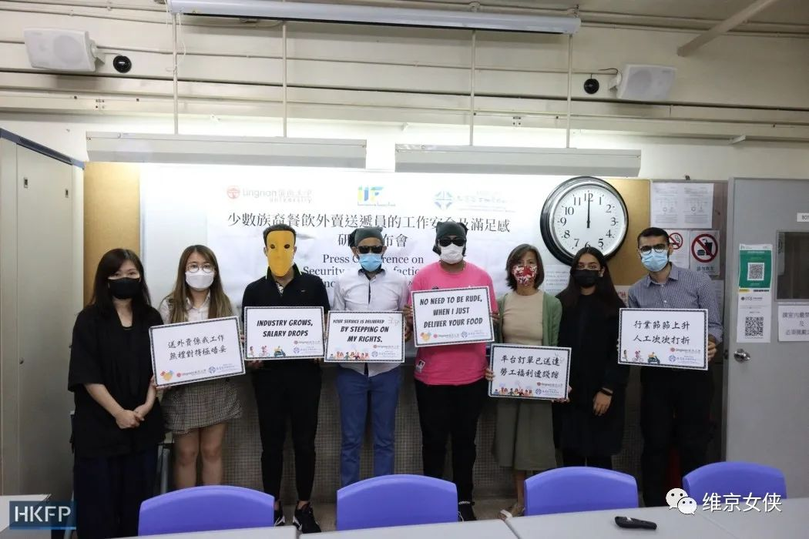
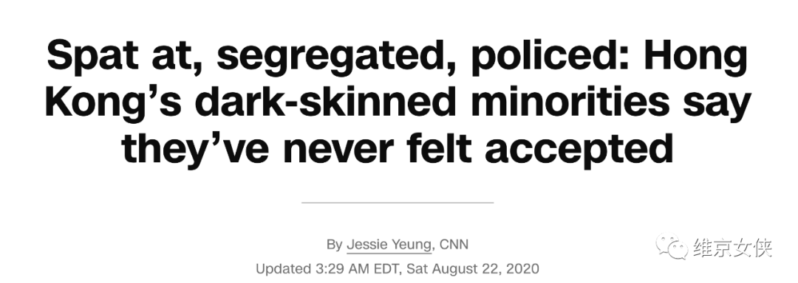

文/女侠，老雷  

**1**

大家好，我是女侠，挪威籍北京人，一个不标准的假洋鬼子。  

今天看了香港国泰航空歧视内地乘客的新闻，女侠内心没有一点波动。  

嗯，这是我熟悉的香港。

十多年前，女侠在香港念书，住了小四年，略有感情。

如今身在内地，我常常想念香港的叉烧油鸡双拼饭，想念诺士佛台的小酒馆，想念打对折的Sasa化妆品店，唯独没想念香港local们。

女侠大半辈子都是‘少数族裔’，在欧美澳都旅居过，算是对‘族群冲突’有一些切身感受。

先说结论，姑且不论南美中东这些地儿，若在当今所有现代化国家与地区中，举办一场‘种族歧视’世锦赛，香港稳拿第一。  

**2**  

如果你认为香港人只是单纯歧视内地人，那你低估他们了。  

去年，香港岭南大学发起了一个调研，考察在香港送外卖的‘少数族裔’是否有受到过种族歧视。  

这些少数族裔大多为‘有色人种’，主要来自巴基斯坦等地。在被调研的近二百人中，一半表示自己遭受过基于种族的‘恶意与咒骂’。  

在香港的外卖点单APP上，常常会有人标注‘不要东南亚的骑手’。  

一位不愿透露姓名的巴基斯坦人说，有一次他走在路上，口罩戴得严严实实，几米开外的一位家长拉着小孩一溜烟跑了，嘴里念叨着‘快跑，病毒来了’。  

这种行为，在如今的欧美，足够让‘歧视’的发起方丢掉饭碗，而在香港则司空见惯。  

全香港有超过百分之五的‘有色人种’，包括四十万菲佣。有些印巴族裔生在香港长在香港，粤语比陈小春还地道，但由于肤色，他们在课堂里被孤立，出社会后找不到白领工作，走在大街上被警察刁难：  

作为一个半辈子在欧美晃悠的少数族裔，我了解‘被孤立’不是香港独有的现象。  

然而问题在于，欧美意识到了这些问题，并且催生了政治正确。在明面上，种族歧视在欧美是绝对的禁地。

至于香港，种族地位链条毫不遮掩：说英文的白人排顶端，其他白人第二，说标准英文的其他人种第三，香港人第四，说粤语的‘外人’第五，至于说国语的内地人，可能勉强地位稍高于菲佣以及印巴体力工人。

香港人种族歧视得光明磊落，在当今文明社会里算得上独树一帜。

**3**

‘种族’，或是‘族群’之间的歧视现象，世界范围内大多数地区都存在，曾经有，现在有，未来也会有。  

北欧是世界上最‘政治正确’的地区，在联合国榜单上，‘人类发展指数’常年前三。  

在北欧，你绝对听不到一句冒犯他人种族的语句。但种族歧视不存在吗？未必。作为‘外族人’，你或许能说一口流利的当地语言，但你大概率会在职场上碰到天花板，而且这块板的高低，与你的能力无关。  

然而，之所以北欧‘人类发展’指数高，是因为它即便有歧视，你也拿不出证据。  

这种政治正确对于少数族裔是好事儿。当地人一脸假笑地说‘我的上帝，我爱中国菜，小笼包子棒极了’，比被吆喝‘滚回中国去’舒适得多。  

世界上绝大部分‘文明国家以及地区’，都有着类似的政治正确，只是程度不同。北欧程度深一些，美国略次之，然而香港，是完全没有。  

为啥香港被西方文化浸染，却没有催生‘政治正确’？  

这就不得不提英美留下的蛊了。

**4**  

欧美式‘政治正确’，大体基于一个理念：

人人生而平等。

虽然大家知道这是一句扯淡的话，但欧美的群众运动，大体是以它为纲领走的。  

马丁路德金抛头颅洒热血，一篇‘我有一个梦想’，把黑人权利运动推向高潮。几十年后，‘不能歧视黑人’算是刻进了美国人的骨髓，成为了‘政治正确’。

为啥马丁路德金能成功？因为‘人人生而平等’，是老美的精神基石，是政治正确的老祖宗。拿着老祖宗当纲领，没法反驳，只能赢。

女权主义运动，LGBTQ运动，老兵运动等等，都是基于这个看上去光辉的理念，最终把自己‘族群’的权利，写进了美国社会的政治正确之中。  

当然，这场运动最终喜剧化，导致美国出现大几十个性别，那不是这篇文章的重点。  

重点在于，香港被英国统治期间，香港人并没有被置于‘人人生而平等’的框架下。  

若了解一些香港历史，你会发现港英期间的统治，堪称铁血。

香港人被灌输‘女皇为大‘，被教育要尊重英国长官。

‘狮子山下’的香港人本来就是一群挺热血的族群，哪受得了这气？他们曾经反抗过 - 1967年，香港刮起五月风暴，杀死了至少十名英国警察。  

但终究还是打不过英国佬。那咋办？只能拿其他族群撒气。  

当时管事儿的英国佬，乐得见你们内部消化戾气，才懒得教导你‘人人生而平等’。  

那些年的香港人，认知虽然不健康，但却平衡。他们被白人歧视，回过头歧视印巴人，歧视‘大陆表叔’，达到了能量守恒。

1997年，香港回归，这个平衡开始动摇。直到近些年，内地经济起势，这个‘歧视生态平衡‘，彻底被打破。

现在的香港虽然没了英国主子，但很多香港人，依然习惯性地仰望欧美人。

仰望多了脖子酸，需要向下看一看，看谁？

在英美资本扶植的媒体渲染下，他们自然而然看向了‘穷亲戚’内地人。  

但突然发现，内地人不穷，也不惯着他们了。

所以有些香港人，认知失调了。  

**后记  
**

香港并不是所有人都充满戾气。相反，有不少香港人，聪明直爽，做事专业，听得明白道理，也放得下身段。  

然而，香港作为特殊时代的特殊地缘产物，算得上‘文明冲突’的前线，有一些印记，需要时间来磨。  

有机会，我还是会去香港转转。我会说粤语，但我会用普通话点菜 - 希望下次拜访香港时，别给我整急眼了。  

\-END-
