There was an extended period of time in my twenties when I didn’t have a job. For most of us, that’s not a big deal. We have our whole lives ahead of us to work, so taking a few months off to “find yourself” can be completely justifiable.  

在我二十多岁的时候，有很长一段时间我没有工作。对我们大多数人来说，这并不是什么大事。我们有一生的时间来工作，所以花几个月的时间来 "寻找自己 "是完全合理的。

Well, let’s just say that wasn’t the case for me.  

好吧，我们只能说对我来说不是这样的情况。

I spent sleepless nights scouring job postings for any company that might be interested in what little I had to offer. I smacked that “Upload Resume” button around like it was my arch nemesis, but made sure to carefully upload the proper file format before doing so.  

我在不眠之夜搜寻招聘信息，寻找任何可能对我所提供的一点东西感兴趣的公司。我把 "上传简历 "的按钮当做我的大克星，但在上传之前，我确保仔细上传适当的文件格式。

My days consisted of nothing but napping, eating, uploading, and submitting. To put it mildly, I was in a state of panic to find some sort of work.  

我的日子除了午睡、吃饭、上传和提交之外，什么都没有。说句不好听的，我当时正处于恐慌状态，想找到某种工作。

Some might have viewed this obsessive job search as an impressive character trait. It may have masqueraded as a signal of ambition, an indicator that I was a guy that had his priorities straight.  

有些人可能把这种执着的求职行为看作是一种令人印象深刻的性格特征。它可能被伪装成一个雄心勃勃的信号，表明我是一个有优先权的人。

The truth, however, was far from that. I wasn’t driven by some magnificent search for purpose, or the nagging desire to provide value to society. I was driven by something far less chivalrous:  

然而，事实却远非如此。我并不是被一些对目标的宏伟追求所驱使，也不是被为社会提供价值的唠叨欲望所驱使。我是被一些远没有骑士精神的东西所驱动：

My intense, terrifying fear of being homeless.  

我对无家可归的强烈、可怕的恐惧。

[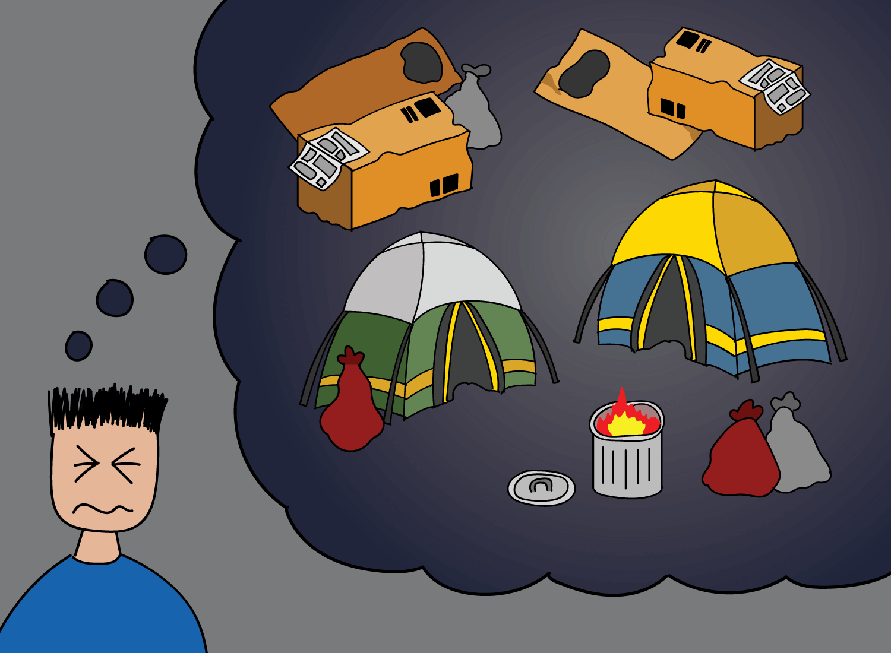](https://moretothat.com/wp-content/uploads/2020/01/A02-Thinking-of-Homelessness.png)

For the longest time, this fear is what drove my panicked desire to find stable, well-paying work (regardless of how [pointless it was](https://moretothat.com/pointless-job/)). I thought that as long as I could save some money with each paycheck, I wouldn’t have to sleep in the streets if something went awry.  

在很长一段时间里，这种恐惧驱使我惊慌失措地想要找到稳定、高薪的工作（不管它是多么毫无意义）。我想，只要我每次发工资都能存下一些钱，如果出了问题，我就不必睡在大街上。

Some of you may understand this fear, while others may view it as deeply irrational. I know people from wealthy backgrounds who have this fear, and people raised on welfare that don’t. My family didn’t have much money growing up, but that doesn’t quite justify the existence of this strain of fright.  

你们中的一些人可能理解这种恐惧，而另一些人可能认为它是非常不理性的。我知道来自富裕背景的人有这种恐惧，而靠福利长大的人则没有。我的家庭在成长过程中并没有多少钱，但这并不完全证明这种恐惧的存在。

Regardless of its origin, this fear was very much alive in me throughout my twenties, and it framed my perspective of money. Instead of viewing money as a generator of wealth, I saw it as an immediate safety net that (barely) kept me away from living on freeway on-ramps. The more of it I had, the more relief and distance it gave me from the streets.  

不管它的起源是什么，这种恐惧在我整个二十多岁的时候都非常活跃，它框定了我对金钱的看法。我没有把钱看作是财富的创造者，而是把它看作是一个直接的安全网，它（勉强）使我不至于生活在高速公路的匝道上。我拥有的钱越多，它就越能让我摆脱街头的困扰。

Well, many years have passed since then, and fortunately, I no longer have this fear.1 However, that doesn’t mean that I no longer think about money. It’s the [greatest story humanity has ever subscribed to](https://moretothat.com/how-money-forever-changed-us/), so it will always be a central character in the theater of everyday life. What has changed isn’t money itself, but the way in which it colors the way I view the world.  

好了，从那时起，很多年过去了，幸运的是，我不再有这种恐惧。1 然而，这并不意味着我不再考虑金钱。它是人类有史以来最伟大的故事，所以它将永远是日常生活戏剧中的核心人物。改变的不是金钱本身，而是它给我看待世界的方式带来的变化。

Life is almost always a framing problem, and wealth is no exception to this. To say that money is complicated is a cliche worthy of a thousand eye rolls, but when it comes to our ongoing relationship with it, I find that it’s quite simple to explain and distill. At any given moment, our journey falls along a vertical spectrum with three main phases:  

生活几乎总是一个框架性的问题，财富也不例外。说钱是复杂的是一个老生常谈，值得一翻白眼，但当涉及到我们与钱的持续关系时，我发现解释和提炼它相当简单。在任何特定的时刻，我们的旅程是沿着一个垂直的光谱，有三个主要阶段：

This is what I call The Money Spectrum, and it represents the wide variety of views we have about the almighty dollar/euro/whatever throughout our lives. Money can be a difficult thing to talk about because it invokes a blend of weird emotions, and this amorphous slushie of feelings can be hard to express through the crude tool of language.  

这就是我所说的 "金钱光谱"，它代表了我们一生中对万能的美元/欧元/任何东西的各种看法。钱可能是一个很难谈论的东西，因为它唤起了各种奇怪的情绪，而这种无定形的感觉很难通过语言这种粗略的工具来表达。

The purpose of the Money Spectrum is to take this formless slushie and build it into a concrete model that we can all understand. The first step to solving a problem is to articulate it clearly, and that’s what this spectrum is here to do.  

金钱谱的目的是把这种无形的泥浆，建立成一个我们都能理解的具体模型。解决问题的第一步是清楚地表达它，而这正是这个光谱的作用。

Each of the three phases represent a specific purpose money has for us, with Phase 1 being the ground level of this journey up the tower. We will go into what each of these three phases are soon, but before we do, keep in mind that this is a spectrum, meaning that we will find ourselves sliding along the scale at any time.  

这三个阶段中的每一个阶段都代表了金钱对我们的特定目的，第一阶段是这一旅程中的基础阶段。我们将很快讨论这三个阶段的内容，但在此之前，请记住这是一个光谱，这意味着我们会发现自己在任何时候都会沿着这个尺度滑动。

It’s entirely possible that someone will be 100% immersed in Phase 1, but it’s more likely that they will be closer to Phase 1 than Phase 2, and will share characteristics of both areas. This is an important distinction that we will make later on in this post, but for now, remember that our relationship with things are rarely absolutes, and money is no exception to this rule.  

完全有可能有人100%沉浸在第一阶段，但更有可能的是，他们更接近第一阶段，而不是第二阶段，并分享这两个领域的特征。这是一个重要的区别，我们将在本篇文章的后面做出区分，但现在请记住，我们与事物的关系很少是绝对的，金钱也不例外。

Let’s begin our journey up the Money Spectrum with this question: when you take a look at your bank account balance, what do you feel?  

让我们从这个问题开始我们的金钱谱系之旅：当你看一看你的银行账户余额，你有什么感觉？

Well, if you’re a part of the 28% of Americans that have [no emergency savings whatsoever](https://www.bankrate.com/banking/savings/financial-security-june-2019/), the answer to that question will likely be a combination of fear and anxiety. When the sole purpose of money is to provide for the basic necessities of life, then your relationship with it will be a shaky one. Scarcity creates fragility, and it is this situation that opens the doors to Phase #1.  

好吧，如果你是28%的美国人中的一员，没有任何紧急储蓄，那么这个问题的答案可能是恐惧和焦虑的结合。当金钱的唯一目的是提供生活的基本必需品时，那么你与它的关系将是不稳定的。匮乏造成脆弱，正是这种情况打开了第一阶段的大门。

### Phase #1: Survival  

第一阶段：生存

[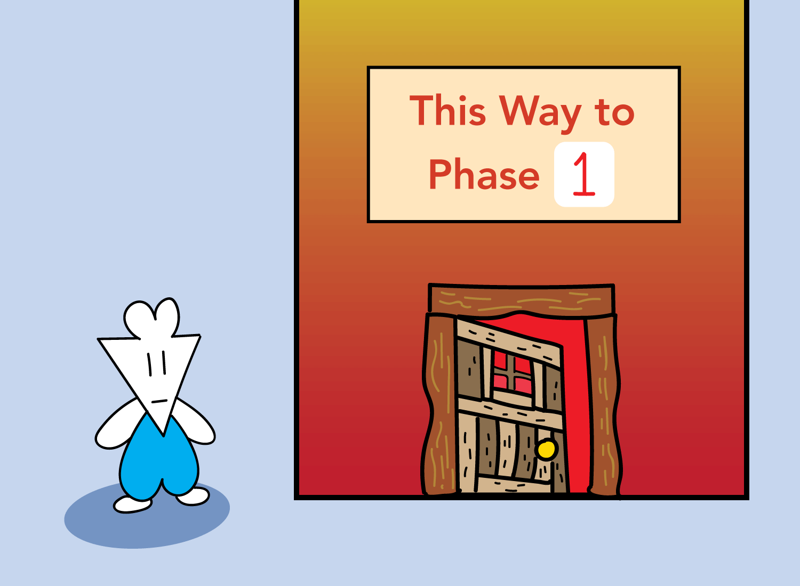](https://moretothat.com/wp-content/uploads/2020/01/B02-Entrance-to-Phase-1.png)

One might say that we all share some space in this part of the spectrum. Ultimately, all the necessities of life require payment of some kind: the food we put in our mouths, the clothes we walk around in, the roof over our heads, etc. Without money we wouldn’t have any of these things, so it’s fair to say that it is a requisite of survival for all of us, right?  

可以说，我们都在这部分领域分享一些空间。归根结底，所有的生活必需品都需要某种形式的支付：我们放进嘴里的食物，我们走动的衣服，我们头上的屋顶，等等。没有钱，我们就不会有这些东西，所以可以说它是我们所有人生存的一个必要条件，对吗？

Well, not quite.  

嗯，不完全是。

While it’s true that money is required to have these basic necessities, that doesn’t mean that we all fear the loss of these necessities equally. A low-income household and an upper middle-class family may both rent property, but the former may worry incessantly about next month’s payment, while the latter may not. Both understand the importance of money, but have different ideas of how their survival could be impacted by the lack of it.  

虽然拥有这些基本必需品确实需要钱，但这并不意味着我们都同样害怕失去这些必需品。一个低收入家庭和一个中产阶级上层家庭可能都租房，但前者可能会不停地担心下个月的付款，而后者可能不会。两者都明白钱的重要性，但对缺少钱会如何影响他们的生存有不同的想法。

The difficult thing about the word “survival” is how subjective it tends to be, as humans are [more reactive to loss than to gain](https://en.wikipedia.org/wiki/Loss_aversion). If a billionaire experienced a sudden reversal in fortune and couldn’t afford his ten-bedroom house anymore, it’s quite possible that he’d say his very survival was being threatened.  

关于 "生存 "这个词的困难之处在于它的主观性，因为人类对损失的反应比对收益的反应更大。如果一个亿万富翁经历了财富的突然逆转，再也买不起他的十间卧室的房子，他很可能会说他的生存受到了威胁。

To remove this fog of subjectivity, let’s zoom in on the Survival part of the spectrum and break it down. When I use the word “survival” in this post, I’m simply referring to one’s ability to exist and to have one’s health. In the illustration below, I’ve separated the section out into its smaller constituents, with the level of poverty increasing the lower you go.  

为了消除这种主观性的迷雾，让我们把生存的部分放大，把它分解。当我在这篇文章中使用 "生存 "一词时，我只是指一个人的生存能力和健康。在下面的插图中，我把这个部分分成了更小的组成部分，越往下贫困程度越高。

At the lowest level, you have no money or access to food, and you are literally starving to death. This is more likely a function of national/civic infrastructure than an individual’s lack of money, as this is quite rare in any first-world country. However, it is still largely a function of having no fiscal resources, and this is the worst place one can find themselves in as a result of that.  

在最底层，你没有钱，也没有机会获得食物，你简直是在饿死。这更可能是国家/公民基础设施的功能，而不是个人缺乏资金，因为这在任何第一世界国家都是相当罕见的。然而，这在很大程度上仍然是一个没有财政资源的功能，而这是一个人可能发现自己处于的最糟糕的地方。

A step up would be the lack of shelter, or homelessness. This is where one’s fears regarding survival can start feeling real, despite the fact that they are probably nowhere near it (my own fear was a good example of this). This likely happens because most of us are vividly familiar with the problem of homelessness, and have grown up seeing real-life evidence of it everywhere.  

更高一级的是缺乏住所，或无家可归。这是一个人对生存的恐惧开始感到真实的地方，尽管事实上他们可能远远没有接近它（我自己的恐惧就是一个很好的例子）。这很可能是因为我们大多数人都对无家可归的问题非常熟悉，并且在成长过程中到处都能看到它的真实证据。

I have clear childhood memories of my parents interacting with the homeless, and you probably do as well. Homelessness is an ever-present window into the difficulties of the human condition, and it reminds you of what can be possible when things go wrong. When we think about our survival being threatened, this familiar sight is where the mind can point to, regardless of how distant that place actually is.  

我有清晰的童年记忆，我的父母与无家可归者互动，你可能也是如此。无家可归者是了解人类困境的一个永远存在的窗口，它提醒你当事情出错时可能会发生什么。当我们想到我们的生存受到威胁时，这种熟悉的景象是头脑中可以指向的地方，不管那个地方实际上有多遥远。

The next few steps up the spectrum have to do with one’s idea of survival once they have their basic necessities (food/water, shelter, and clothing). Survival is no longer a relentless exercise in acquiring these necessities, but more so a strong commitment in maintaining them. And of course, the fuel that keeps the resource engine running is money.  

接下来的几个步骤与一个人拥有基本必需品（食物/水、住所和衣服）后的生存观念有关。生存不再是为了获得这些必需品的不懈努力，而是对维持这些必需品的坚定承诺。当然，维持资源引擎运转的燃料是金钱。

In order to sustain the health of oneself and one’s family, a consistent stream of income is needed, and this generally comes in the form of paid employment. Keep in mind that toward the upper-end of the Survival phase, you are no longer fighting for existence; you are fighting for preservation. You want the flow of money to be predictable, something you can count on every few weeks to sustain the level of basic resources you need.  

为了维持自己和家人的健康，需要有稳定的收入来源，而这通常是以有偿工作的形式出现。请记住，在生存阶段的高端阶段，你不再为生存而战，而是为保存而战。你希望金钱的流动是可预测的，你可以每隔几周依靠它来维持你需要的基本资源水平。

A job provides this sense of security, and when you view money as a means for survival, holding this job is all that matters. It doesn’t matter how much you hate your job or how terrible the working conditions may be; as long as the number of hours you work result in a predictable deposit amount, you’ll succumb to it.  

一份工作提供了这种安全感，当你把钱看作是一种生存手段时，持有这份工作就是最重要的。你有多讨厌你的工作或工作条件有多糟糕并不重要；只要你工作的小时数能带来可预测的存款额，你就会屈服于它。

But if this pattern continues and time runs in your favor, there’s a point in which the lines between the Survival phase and Phase #2 (which I’ll reveal shortly) start getting blurry.  

但是，如果这种模式继续下去，而且时间对你有利，那么有一点，生存阶段和第2阶段（我很快就会揭示）之间的界限开始变得模糊。

At what point does your job provide you with enough money to feel a sense of security? Is it when you’re no longer living paycheck-to-paycheck and you’re able to save some money each month? If that’s the case, what do your savings have to look like for you to feel a sense of relief? $2,000? $10,000? $30,000?  

在什么时候，你的工作为你提供了足够的资金，让你有安全感？是不是当你不再靠工资生活，并且你能够每个月存一些钱的时候？如果是这样的话，你的储蓄要达到什么程度才会让你感到轻松？$2,000? $10,000? $30,000?

Toward the upper end of this phase, survival becomes more about your mindset and less about your reality. You are well past the place where you risk sleeping in the streets, but you may continue to operate under the belief that it could happen at any time. This traps you into a limited way of thinking, and paralyzes your potential for growth.  

在这个阶段的上端，生存变得更多的是关于你的心态，而不是关于你的现实。你已经过了冒着睡在街上的风险的阶段，但你可能继续在这种信念下运作，认为它随时可能发生。这使你陷入了一种有限的思维方式，并麻痹了你成长的潜力。

When you’re in a survival mindset, you will always feel like you’re barely holding onto what you have. Whether that’s $1,000 or $100,000, nothing you have can adequately push away the fears you have about sliding down the spectrum. This may be the result of parental conditioning, personal experience, or any number of reasons, but the longer you view money as a means for survival, the less willing you will be to take the risks required to lead a fulfilling life.  

当你处于生存心态时，你总是会觉得你在勉强坚持你所拥有的东西。无论那是1000美元还是10万美元，你所拥有的一切都不能充分推开你对滑落的恐惧。这可能是父母条件、个人经验或任何原因的结果，但你将金钱视为生存手段的时间越长，你就越不愿意承担过上充实生活所需的风险。

Risk is usually accompanied with the emotion of fear, and if you’re operating on survival mode, you will be scared to do anything uncertain, no matter how small that risk actually is:  

风险通常伴随着恐惧的情绪，如果你在生存模式下运作，你会害怕做任何不确定的事情，无论这个风险实际上有多小：

With this level of consistent fear, you won’t do anything outside of your comfort zone. You’ll never ask for that promotion in fear of getting fired, you’ll never invest money in the stock market in fear of losing it, and you’ll never pursue something purposeful in fear of being penniless.  

有了这种程度的持续恐惧，你就不会做任何超出你舒适区的事情。你不会因为害怕被解雇而要求升职，你不会因为害怕失去金钱而在股市投资，你不会因为害怕身无分文而追求有意义的东西。

The most meaningful things in life come with some level of risk, and if you’re in survival mode, you won’t take them. The stakes will always seem too high, even if the downside to that risk is capped.  

生活中最有意义的事情都有一定程度的风险，如果你处于生存模式，你就不会采取这些措施。赌注似乎总是太高，即使这种风险的负面效应是有限度的。

The key to shifting out of survival mode is to realize that you have enough. The word “enough” may evoke different feelings from different people, but I’m simply referring to the amount you require to have your basic necessities covered.  

摆脱生存模式的关键是要意识到你有足够的东西。足够 "这个词可能会唤起不同人的不同感受，但我只是指你需要的基本生活必需品的数量。

Do you have enough money to have a roof over your head? If you quit your job, will you really end up homeless, or will you be fine? Is your anxiety about money largely unfounded, considering you have your basic needs covered?  

你有足够的钱让你的头顶上有一个屋顶吗？如果你辞掉工作，你真的会无家可归，还是会没事？考虑到你的基本需求已经得到满足，你对钱的焦虑在很大程度上是没有根据的吗？

Survival mode is turned on when reality is clouded by the fog of fear. It turns a completely manageable situation into one that is overblown, and every small decision regarding money causes immense anxiety.  

当现实被恐惧的迷雾所笼罩时，生存模式就会开启。它将一个完全可以控制的情况变成一个被夸大的情况，每一个关于金钱的小决定都会引起巨大的焦虑。

Removing this fog requires rationality, along with the understanding that everything will be okay. As long as you remain committed to your financial well-being, things have a funny way of working themselves out. If you lost your job, you will find another one. If you didn’t hit your savings goal, you’ll eventually get there. If you overspent your budget this month, you’ll make up for it in the next one.  

消除这种迷雾需要理性，同时理解一切都会好起来。只要你对你的财务状况保持承诺，事情就会以一种有趣的方式自行解决。如果你失去了工作，你会找到另一份工作。如果你没有达到你的储蓄目标，你最终会达到的。如果你这个月的预算超支了，你会在下个月补上。

Once you realize that money is a resource you own – and not the other way around – you will see money for what it really is: a tool that amplifies the values you already espouse.  

一旦你意识到钱是你拥有的资源--而不是相反--你就会看到钱的真正含义：一个放大你已经支持的价值观的工具。

In the next phase of the spectrum, money becomes a mechanism, rather than the end result. It is here where its value truly shines, as it enables you to live a life that coincides with purpose.  

在光谱的下一个阶段，金钱成为一种机制，而不是最终结果。在这里，它的价值才真正闪耀，因为它使你的生活与目的相吻合。

### Phase #2: Freedom  

第二阶段：自由

I recall a conversation where a friend was telling me how much she hated her job. When I asked her why she was still working there, she begrudgingly replied, “Well, it provides a lifestyle that my family and I can enjoy. We can go on cool vacations together, see interesting places, and eat amazing meals. I guess that’s what makes it worth it.”  

我记得有一次谈话，一位朋友告诉我她有多讨厌她的工作。当我问她为什么还在那里工作时，她勉强地回答："嗯，它提供了一种我和家人可以享受的生活方式。我们可以一起去享受很酷的假期，看到有趣的地方，吃到美味的食物。我想这就是它的价值所在。"

This is the first taste of money as a tool for freedom. When money is used to sustain a lifestyle rather than life itself, you have moved out of Survival and into this new territory.  

这是第一次尝到金钱作为自由工具的滋味。当金钱被用来维持一种生活方式而不是生活本身时，你已经走出了生存状态，进入了这个新的领域。

One of the most common forms of freedom is leisure. Once you have your basic needs covered, leisure becomes the manner in which you express your tastes and preferences to yourself and others. Purchasing memorable experiences and delicious meals is not only pleasant, it also signals the things that are important to who you are.2  

最常见的自由形式之一是休闲。一旦你的基本需求得到满足，休闲就成为你向自己和他人表达你的品味和喜好的方式。购买令人难忘的经历和美味的食物不仅是令人愉快的，它也标志着对你是谁很重要的东西。

When you and your family are sitting on beach chairs in a faraway country, overlooking the oscillating waves of the sea, it can evoke feelings of the good life. It can make you feel like you’ve reached the pinnacle of freedom, and that everything you had to do in life was worth it for this moment.  

当你和你的家人坐在远方国家的沙滩椅上，俯瞰大海的振荡波，可以唤起对美好生活的感受。它可以让你感觉到你已经达到了自由的顶峰，你在生活中所做的一切都值得这一刻的到来。

But this is also where the problem lies.  

但这也是问题所在。

The price of leisure can be high, and since [life familiarizes us with its contents](https://moretothat.com/what-makes-death-bad/), we tend to want more of what we already have. If leisure is the way we express our freedom, we would be willing to do all kinds of tedious work to fund that form of expression.  

闲暇的价格可能很高，由于生活让我们熟悉它的内容，我们倾向于想要更多我们已经拥有的东西。如果休闲是我们表达自由的方式，我们会愿意做各种繁琐的工作来资助这种表达形式。

This is the situation that my friend found herself in. She was putting up with mind-numbing, pointless work so it would give her the resources to fund the lifestyle choices that made life a little more pleasant.  

这就是我的朋友发现自己所处的情况。她忍受着令人头疼的、毫无意义的工作，这样就能给她提供资源，资助她选择使生活更愉快的生活方式。

The problem with freedom-as-leisure is that it is fundamentally asymmetrical. You have to work significantly more hours for each hour of leisure you may gain, which means that if you hate your job, you have to accumulate a lot of misery before you can cash it in for freedom.  

自由即休闲的问题在于，它从根本上是不对称的。你必须为你可能获得的每一个小时的休闲而工作更多的时间，这意味着如果你讨厌你的工作，你必须积累大量的痛苦，然后才能把它兑现为自由。

The sad reality is that many people don’t enjoy their jobs, nor do they learn much from them. If you combine this with the fact that we spend over a third of our lives working, you have a situation where money is the only reason you’re waking up each morning for a long, long time.  

可悲的现实是，许多人并不喜欢他们的工作，也没有从他们那里学到很多东西。如果你把这一点与我们一生中超过三分之一的时间都在工作这一事实结合起来，你就会发现，在很长很长时间内，钱是你每天早上醒来的唯一原因。

This is why these are the top results when you search “retirement” in Google Images:  

这就是为什么当你在谷歌图片中搜索 "退休 "时，这些是最重要的结果：

For most people, retirement means they are finally free to do whatever they want without worrying about money. They could finally leave their jobs, [travel around the world](https://moretothat.com/travel-is-no-cure-for-the-mind/), and set their schedules so it fits their rhythm of life.  

对大多数人来说，退休意味着他们终于可以自由地做他们想做的事情，而不用担心钱的问题。他们终于可以离开工作岗位，到世界各地旅行，并设定自己的时间表，使之适合自己的生活节奏。

However, this is a low bar for freedom. Giving away thirty-plus years of your life to an indifferent career is like spending all your youth with a partner that you’d rather not be around. When you finally break free of that job or relationship, you’ll be left wondering what else you could have done with all that misspent energy.  

然而，这是一个低标准的自由。把你三十多年的生命交给一个冷漠的职业，就像把你的青春都花在一个你不愿意在身边的伙伴身上。当你最终挣脱那份工作或关系时，你会想知道你还能用那些被滥用的精力做什么。

As long as money is the top priority for why you work, you will be trapped in the lowest part of the Freedom phase. To escape this trap, the way you view money needs a perspective shift:  

只要金钱是你工作原因的首要考虑，你就会被困在自由阶段的最低部分。为了摆脱这个陷阱，你看待金钱的方式需要进行视角转换：

Rather than using money as the ticket out of an unfulfilling career, use it as the ticket in to a fulfilling one.  

与其把钱作为离开不满意的职业的门票，不如把它作为进入满意职业的门票。

The next point up the spectrum is the freedom money can buy as it relates to your work.  

下一点是金钱可以买到的自由，因为它与你的工作有关。

In the freedom-as-leisure (or traditional retirement) model, the rank-order of the reasons for work was this:  

在自由即休闲（或传统退休）模式中，工作原因的排序是这样的：

[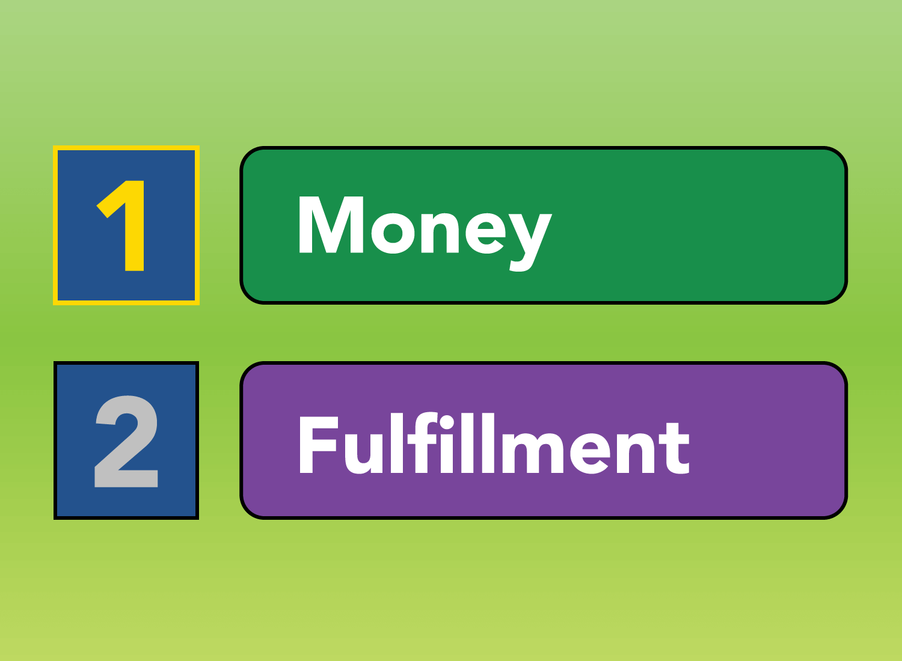](https://moretothat.com/wp-content/uploads/2020/01/D04-Money-over-fulfillment.png)

But in the freedom-in-work model, the order of priorities switches:  

但在工作自由模式中，优先顺序发生了变化：

It’s still important to make money, but its purpose extends beyond its mere accumulation. Its primary purpose is to give you the freedom to work on the things you want to build.  

赚钱仍然很重要，但它的目的超出了单纯的积累。它的主要目的是让你有自由去从事你想建立的事情。

This is where you realize that work isn’t about retirement; it’s about working on the things you’d do if money wasn’t even a factor. Whether you made $1,000 a month or $10,000, you’d continue working on the same projects, day in and day out. Not because they’re profitable, but because you enjoy the hard work it takes in building them.  

这时你会意识到，工作并不是为了退休；而是为了工作，如果钱根本不是一个因素，你会做的事情。无论你每月赚1000美元还是10000美元，你都会继续从事同样的项目，日复一日地工作。不是因为它们有利可图，而是因为你喜欢建设它们所需要的艰苦工作。

Of course, the question here then becomes, “How much money do I need to buy this type of freedom?”  

当然，这里的问题就变成了，"我需要多少钱才能买到这种自由？"

The answer will vary based on your circumstances (the biggest ones being where you live and if you have a family of your own), but it’s probably not as high as you would expect.  

答案将根据你的情况而变化（最大的情况是你住的地方和你是否有自己的家庭），但它可能没有你所期望的那么高。

The first thing that the freedom-in-work model does is that it lowers the threshold of money you need to continue your work. When work in itself is fulfilling and worthwhile, you become more content with a minimal lifestyle.  

工作中的自由模式的第一件事是，它降低了你继续工作所需的金钱门槛。当工作本身是充实和有价值的，你就会对最低限度的生活方式更加满意。

This is because money no longer serves as a reliable signal of your worth and priorities. In the freedom-as-leisure model, the amount of money you made from your job was of utmost importance. If money was the only justification for your continued employment, that salary better be high enough to make your time worth it.  

这是因为金钱不再作为你的价值和优先事项的可靠信号。在自由即休闲的模式中，你从工作中赚到的钱是最重要的。如果钱是你继续工作的唯一理由，那么这个工资最好高到足以让你的时间变得值得。

But in the freedom-in-work model, money is simply the fuel you need to keep you and your endeavor running. If you combine this with the zero marginal cost nature of the internet ([especially for content creators](https://moretothat.com/economics-of-writing/)), you don’t need much to live your day-to-day life. As long as your basic necessities are covered, you can continue working on the things you care about for a surprisingly long time.3  

但在工作中的自由模式中，钱只是你需要的燃料，以维持你和你的努力运行。如果你把这一点与互联网的零边际成本性质结合起来（特别是对内容创作者而言），你不需要太多的东西来过你的日常生活。只要你的基本生活需求得到满足，你就可以继续从事你所关心的事情，而且时间会出奇的长。

While this sounds liberating, I get that it can seem far-fetched. Untying money from your self-worth is a rather difficult thing to do. We’ve been conditioned to view money as an indicator of success, and it is a status signal that is recognized anywhere in the world. Wealth drives perceptions, both of ourselves and others.  

虽然这听起来很自由，但我知道这可能看起来很牵强。将金钱与你的自我价值联系起来是一件相当困难的事情。我们已经被调教成将金钱视为成功的指标，而且它是一个在世界任何地方都被认可的地位信号。财富驱动着人们的看法，包括对自己和他人的看法。

But ask yourself: how long will these societal norms control the way you live your life? What’s so great about having money if you’re using it to live a life you’re expected to live, instead of one that makes sense for your unique abilities and perspectives?  

但问问自己：这些社会规范要控制你的生活方式多久？如果你用它来过你所期望的生活，而不是用你独特的能力和观点来过有意义的生活，那么拥有金钱有什么了不起呢？

Money is easily replicable, humans are not. There is no one out there that shares your same genetic makeup, let alone your life experiences. While a dollar is innumerable, you are – quite literally – one of one.  

金钱是容易复制的，而人是不容易复制的。没有人与你有相同的基因构成，更不用说你的生活经历。虽然一美元是无数的，但你--从字面上看--是唯一的一个。

So don’t let something plentiful like money be the [building blocks of your identity](https://moretothat.com/small-things/). Instead, allow it to amplify the authentic voice only you can have.  

因此，不要让像金钱这样丰厚的东西成为你身份的组成部分。相反，让它来放大只有你才能拥有的真实声音。

[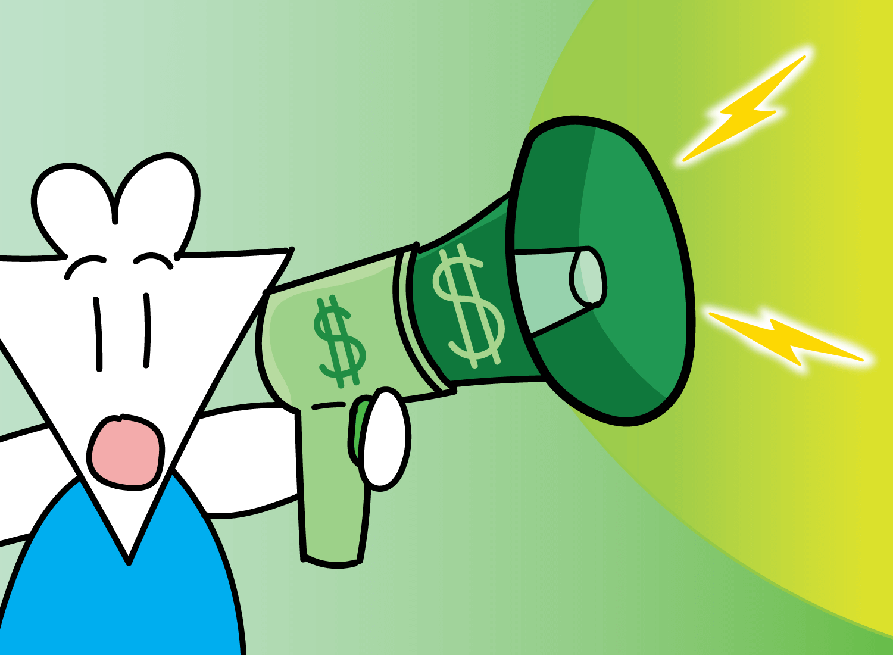](https://moretothat.com/wp-content/uploads/2020/01/E04-Money-Megaphone.png)

In the freedom phase, money is seen as a tool, an amplifier of the authenticity you embody. It is the resource that allows you to take care of yourself as you work on the problems you find worthwhile. You don’t need a lot to keep going, you just need enough.  

在自由阶段，金钱被看作是一种工具，是你所体现的真实性的放大器。它是一种资源，使你在处理你认为有价值的问题时能够照顾自己。你不需要很多钱来维持下去，你只需要足够的钱。

Although the mindset of “enough” sounds great, I understand that it can be difficult. After all, the hardest part of this journey may be the stress that comes from monitoring the balances in your bank account. If you’re pursuing this endeavor as a side hustle, you may have some leeway here, but if it’s your full-time thing, the fact that “enough” may be slightly out-of-reach can induce anxiety.  

虽然 "够用 "的心态听起来很好，但我明白这可能很困难。毕竟，这段旅程中最困难的部分可能是监测你银行账户余额所带来的压力。如果你把这项工作作为副业来做，你可能会有一些回旋余地，但如果它是你的全职工作，"足够 "这个事实可能稍微有点遥不可及，会引起焦虑。

The key here is to remain (1) diligent, (2) patient, and (3) rational.  

这里的关键是要保持（1）勤奋，（2）耐心，和（3）理性。

Diligence refers to your work ethic. There are no shortcuts to this. No amount of wishful thinking can substitute the necessity of hard work.  

勤奋是指你的工作态度。这方面没有捷径可走。任何一厢情愿的想法都不能取代勤奋工作的必要性。

Patience refers to your resilience. The benefits of compounding always come later, and patience is what allows you to drive the long, bumpy road necessary to get there.  

耐心是指你的韧性。复利的好处总是后来才有的，而耐心是使你能够驾驶到达目的地所需的漫长而颠簸的道路。

Rationality refers to your mindset. Will you helplessly slide down into Survival mode, or will you understand that you’re actually exercising freedom, spending your time solving the problems [you want to work on](https://moretothat.com/thankfully-life-is-full-of-problems/)? Can you be rational about your situation, and understand that you will be okay?  

理性是指你的心态。你会无助地滑落到生存模式，还是会明白你实际上是在行使自由，把时间花在解决你想努力解决的问题上？你能理性地看待你的情况，并明白你会好起来的？

Combine these three tenets with the mindset of “enough,” and eventually you will find yourself in an interesting situation. A while ago, nobody seemed to care about what you were working on, but now, a niche of people have grown to love your work. Some of them even pay you for your services, your products, or whatever you have to offer. Slowly but surely, you’re able to expand your money tool belt a few notches.  

将这三个信条与 "足够 "的心态相结合，最终你会发现自己处于一个有趣的境地。前一段时间，似乎没有人关心你在做什么，但现在，有一小群人已经开始喜欢你的工作。他们中的一些人甚至为你的服务、你的产品、或你所提供的任何东西付钱。缓慢但肯定的是，你能够将你的金钱工具带扩大几个档次。

When the income you generate from your endeavor begins to exceed the threshold of costs to keep things going, you get what I call the Fulfillment Surplus.  

当你从你的努力中产生的收入开始超过维持事物的成本门槛时，你就会得到我所说的 "履行盈余"。

The Fulfillment Surplus is the best kind of money one can have. Not only do you have more than you need, you’ve earned it doing something that you would have done for free. Better yet, the reverse is also true: you would’ve worked on this endeavor even if you had all the money in the world.  

履行盈余是一个人所能拥有的最好的钱。你不仅拥有比你需要的更多的钱，而且你是在做一些你本来可以免费做的事情时赚到的。更好的是，反过来也是如此：即使你有世界上所有的钱，你也会为这个努力工作。

But perhaps the best part of the Fulfillment Surplus is that it frees your attention away from money. The hardest part about doing meaningful work isn’t the work itself, but the stress that can result from frequently checking your bank account balances. The Fulfillment Surplus is the ticket that takes you away from here and into the highest end of the Freedom phase:  

但是，"成就感盈余 "最好的部分可能是，它将你的注意力从金钱上解放出来。做有意义的工作最困难的部分不是工作本身，而是经常检查你的银行账户余额可能导致的压力。实现盈余是带你离开这里，进入自由阶段的最高端的门票：

Freedom-in-attention.

When we think of financial freedom, we tend to picture a super rich person in this situation:  

当我们想到财务自由时，我们往往会想象一个超级富翁的这种情况：

And when we think of someone’s who not financially free, we picture an average person in this scenario:  

而当我们想到某人在财务上不自由时，我们会想象一个普通人在这种情况下的情景：

[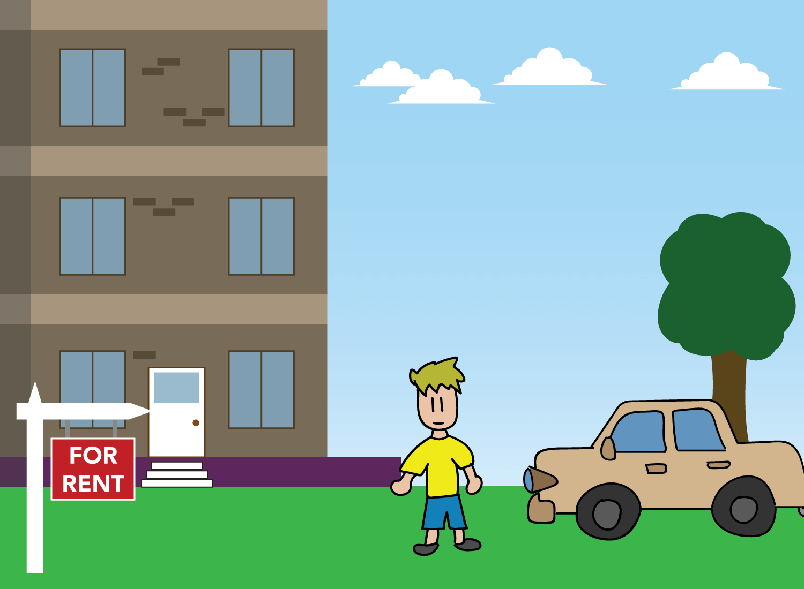](https://moretothat.com/wp-content/uploads/2020/01/G02-Average-person-at-apartment-revised.png)

However, if the super rich guy spends all his energy thinking about how much money he has and how he’s going to sustain this lifestyle, then he is not wealthy:  

然而，如果超级富翁把所有的精力都花在思考他有多少钱，以及如何维持这种生活方式上，那么他就不是富翁：

But if the average person doesn’t ruminate about money because he knows he has everything he needs, then he is wealthy:  

但是，如果普通人不反刍金钱，因为他知道他拥有他所需要的一切，那么他就是富有的：

Financial freedom isn’t about money, it’s about attention. The less you have to think about money, the more free you actually are.  

财务自由不是关于钱，而是关于注意力。你越是不需要考虑钱的问题，你实际上就越是自由。

This is what the Fulfillment Surplus helps you realize. Once you get to the top of the Freedom phase, you are using money in a way that serves you. It is a tool that has enabled you to do the things you love, and has drifted out of focus when it has fulfilled that specific purpose. This is the sweetest spot in all of the Money Spectrum, and if we didn’t have any other aspirations or desires, then we’d be wise to stay here for a long time.  

这就是 "成就感盈余 "帮助你实现的东西。一旦你到了自由阶段的顶峰，你就会以一种为你服务的方式使用金钱。它是一种工具，使你能够做你喜欢的事情，当它满足了特定的目的后，就会渐渐失去关注。这是所有金钱谱系中最甜蜜的地方，如果我们没有任何其他的愿望或欲望，那么我们在这里停留很长时间会是明智的。

However, it’s inevitable that our relationship with money will extend past the domain of the self. If we have families, we will want to use money in a way that gives our children the best possible lives. If we are part of a community, we will want to use money in a way that allows our fellow members to thrive.  

然而，我们与金钱的关系将不可避免地延伸到自我的领域之外。如果我们有家庭，我们会希望用钱的方式让我们的孩子过上最好的生活。如果我们是社区的一部分，我们将希望以一种让我们的同伴茁壮成长的方式来使用金钱。

When it comes to the network of lives that are connected to ours, money can amplify these bonds dramatically… for better or for worse. It’s up to us to determine which direction it’ll go in, and this reflection takes us into the final phase of the Money Spectrum.  

当涉及到与我们相连的生命网络时，金钱可以极大地放大这些联系......无论是好是坏。由我们来决定它的方向，这个思考将我们带入金钱谱系的最后阶段。

### Phase #3: Power  

阶段#3：权力

When you think of the word “power,” an image like this probably comes to mind:  

当你想到 "权力 "这个词时，脑海中可能会出现这样的画面：

[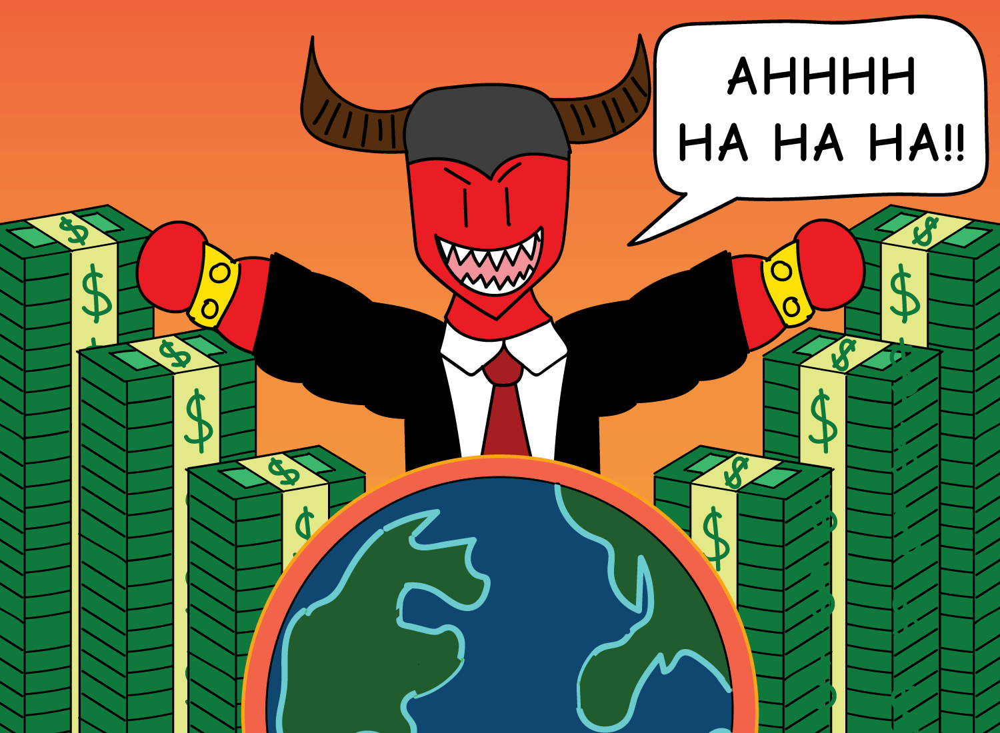](https://moretothat.com/wp-content/uploads/2020/01/H01-World-Domination-and-Power.png)

But let’s take a moment to see how our linguistic overlords at Oxford actually [define the word](https://www.lexico.com/en/definition/power).  

但是，让我们花点时间看看我们牛津大学的语言学霸主是如何真正定义这个词的。

Power:  

权力：

1\. the ability to do something or act in a particular way, especially as a faculty or quality.  

1.以特定方式做某事或行事的能力，特别是作为一种能力或品质。

2\. the capacity or ability to direct or influence the behavior of others or the course of events.  

2\. 指挥或影响他人行为或事件进程的能力或才能。

These two definitions provide a good framework to understand power, but notice that there’s no value judgment in either of them.  

这两个定义为理解权力提供了一个很好的框架，但请注意，这两个定义中都没有价值判断。

Power in itself is neither good nor evil. We often conflate the outcome of one’s power with one’s possession of it, but we must remember that these are two wholly different things. If someone used power in a horrible way, that doesn’t mean power in itself is evil. It just means that a shitty person got their grubby hands on a value-neutral ball of influence, and exercised it with malice.  

权力本身既不是善也不是恶。我们经常把一个人的权力的结果与他对权力的拥有混为一谈，但我们必须记住，这是两件完全不同的事情。如果有人以一种可怕的方式使用权力，这并不意味着权力本身是邪恶的。它只是意味着一个低劣的人得到了他们肮脏的手，在一个价值中立的影响球上，并以恶意的方式行使它。

At its core, power is about two things:  

在其核心，权力是关于两件事：

\[Definition #1\] One’s ability to act freely, and  

\[定义1\] 一个人自由行动的能力，以及

\[Definition #2\] One’s ability to influence the behavior of others.  

\[定义2\] 一个人影响他人行为的能力。

When you first cross the border between Freedom and Power on the Money Spectrum, you are making a seamless transition into Definition #1. With an abundant Fulfillment Surplus on hand, you are pursuing the things you want to pursue, while limiting the attention you give to the continuous demands of money.  

当你第一次跨越金钱光谱上的自由与权力的边界时，你正在无缝过渡到定义1。有了丰富的满足感盈余，你正在追求你想追求的东西，同时限制你对金钱的持续需求的关注。

I call this initial territory power-over-the-self.  

我把这一初始领域称为 "超越自我的力量"。

[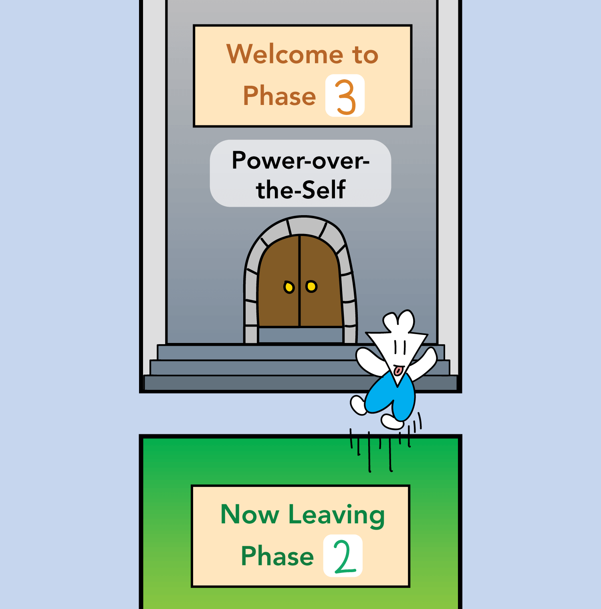](https://moretothat.com/wp-content/uploads/2020/02/I01-Heading-into-Phase-3-revised.png)

We’re not going to linger here too long because it’s similar to the upper end of the Freedom phase, but there’s one important statement I want to go over before we proceed:  

我们不会在这里逗留太长时间，因为它类似于自由阶段的上端，但在我们继续之前，有一个重要的声明我想说一下：

The way you exercise power over yourself will set the conditions for how you exercise power over others.  

你对自己行使权力的方式将为你如何对他人行使权力创造条件。

In other words, the way you express your autonomy will construct the views you have of others. And nowhere is this more apparent than the way we use our money.  

换句话说，你表达你的自主权的方式将构建你对他人的看法。而这一点最明显的莫过于我们使用金钱的方式。

If you want to express your individual power by buying yachts, wearing gold chains, and balling out at night clubs, then that does two things. First, it signals to others that these are the things that matter to you, and they will tie your human worth to your material worth. Second, you will view others through this same lens, and you will see materiality as the answer to solving their problems in turn.  

如果你想通过购买游艇、佩戴金链子和在夜总会打球来表达你的个人力量，那么这有两件事。首先，它向其他人发出信号，这些是对你很重要的东西，他们会把你的人类价值与你的物质价值联系起来。第二，你将通过这个镜头来看待其他人，你将把物质视为解决他们问题的答案。

This leads to a vicious cycle where money is how you’re viewed, and money is how you view the world. Emotions like love and sympathy are incredibly nuanced, and believing that you can express them with a crude tool like cash will put a nasty taste in the mouths of the people that matter most (more on this soon).  

这导致了一个恶性循环，金钱是你的看法，而金钱是你看待世界的方式。像爱和同情这样的情感是非常细微的，如果认为你可以用现金这样的粗糙工具来表达它们，就会让最重要的人感到厌恶（关于这一点，很快就会有更多信息）。

Understanding how you want to exercise your individual power is the key to navigating the next – and final – area of the spectrum: power-over-others.  

了解你想如何行使你的个人权力，是驾驭光谱的下一个--也是最后一个--区域的关键：对他人的权力。

“Power-over-others” sounds menacing, but remember, it simply refers to one’s ability to influence the behavior of others. The key question in this area is: how are you using money to direct the course of people’s lives?  

"超越他人的权力 "听起来很吓人，但记住，它只是指一个人影响他人行为的能力。这个领域的关键问题是：你是如何利用金钱来引导人们的生活轨迹的？

For most of us, the power of money resides in its ability to provide a better life for our families. With this precious resource, we are able to provide a better education for our children, larger homes for our partners, and grander vacations for our parents. These things provide a solid foundation for our family’s futures, and will direct the course that these lives will ultimately take.  

对于我们大多数人来说，金钱的力量在于它能够为我们的家庭提供更好的生活。有了这种宝贵的资源，我们能够为我们的孩子提供更好的教育，为我们的伴侣提供更大的房子，为我们的父母提供更大的假期。这些东西为我们家庭的未来提供了一个坚实的基础，并将引导这些生活最终的方向。

If influence were a tower, the immediate level up from the self would be the domain of family. The power of money in this realm is immediate, as your loved ones will see evidence of it in the form of higher-quality life experiences.  

如果影响力是一座塔，那么从自我向上的那一层就是家庭领域。金钱在这个领域的力量是直接的，因为你的爱人会看到它以更高质量的生活体验的形式出现。

However, that doesn’t mean that the power of money will always yield a better family life. In fact, the reverse can be true: the more you elevate the importance of money, the more you may be (unintentionally) isolating yourself from them.  

然而，这并不意味着金钱的力量总是会产生更好的家庭生活。事实上，情况可能恰恰相反：你越是提升金钱的重要性，你就越可能（无意中）将自己与他们隔离。

This is where the greatest distinction between Power and Freedom resides. The upside of power is generally capped, whereas the upside of freedom is not. With power, there is usually a point where more of it starts having an adverse effect. If the influence over others becomes too great (even if it’s in the name of well-being), it can breed distrust, envy, and resentment.  

这就是权力和自由之间最大的区别所在。权力的上升空间通常是有上限的，而自由的上升空间则没有。对于权力，通常有一个点，即更多的权力开始产生不利影响。如果对他人的影响变得太大（即使是以福利的名义），它可能会滋生不信任、嫉妒和怨恨。

Baked into each layer of influence is the Power Tradeoff, where the green area represents the benefits of having the power of money, and the red signifies its more detrimental aspects.  

在每一层影响中，都有权力的权衡，其中绿色区域代表拥有金钱权力的好处，而红色则表示其更不利的方面。

[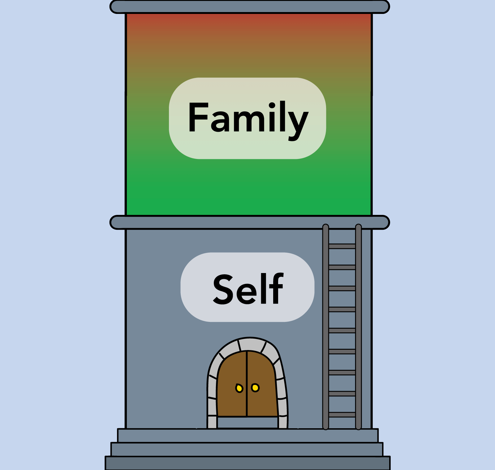](https://moretothat.com/wp-content/uploads/2020/01/I04-Family-Power-Tradeoff.png)

The above image shows the family layer’s Power Tradeoff, where both green and red areas exist. The green part should come as no surprise – the main reason why people work so much is so they could provide for their families. The more money they make, the more power they have to elevate the well-being of their loved ones.  

上图显示了家庭层的权力权衡，其中绿色和红色区域都存在。绿色部分应该不足为奇--人们工作这么多的主要原因是为了能够供养他们的家人。他们赚的钱越多，他们就有更多的权力来提升他们所爱的人的幸福感。

The red part represents the other side of the story. There are many children who never get to see their parents because they’re out working 90-100 hours a week. They might live in a huge house with all the things they want, but the sense of abandonment can morph into resentment.  

红色部分代表故事的另一面。有许多孩子从来没有机会看到他们的父母，因为他们每周在外面工作90-100小时。他们可能住在一个巨大的房子里，拥有所有他们想要的东西，但被抛弃的感觉可能会演变成怨恨。

This red section is what happens when you forget that pursuing your idea of power has a deep effect on others. Many parents believe that working hard and making money is how they express their love for their children, but miss the fact that their children may not see it the same way. This leads to situations where these parents work tirelessly to become millionaires, only to see that their relationships with their kids have been defined by lost opportunities.  

这个红色部分是当你忘记追求自己的权力观念对他人产生深刻影响时的情况。许多父母认为，努力工作和赚钱是他们表达对孩子的爱的方式，但却忽略了他们的孩子可能不会以同样的方式看待这个事实。这就导致了这样的情况：这些父母孜孜不倦地工作，成为百万富翁，但却看到他们与孩子的关系已经被失去的机会所定义。

However, in this Power Tradeoff, the green still outweighs the red because we are eventually able to understand the nature of sacrifice. As long as we know that our parents love us, we are able to empathize with their plight, and understand the hustle they put in to provide better lives for everyone. This may take time, but if rationality prevails, these types of family difficulties can be healed in the long run.  

然而，在这种权力交换中，绿色仍然大于红色，因为我们最终能够理解牺牲的本质。只要我们知道父母爱我们，我们就能够同情他们的困境，并理解他们为给大家提供更好的生活而付出的努力。这可能需要时间，但如果理性占上风，这些类型的家庭困难从长远来看是可以治愈的。

[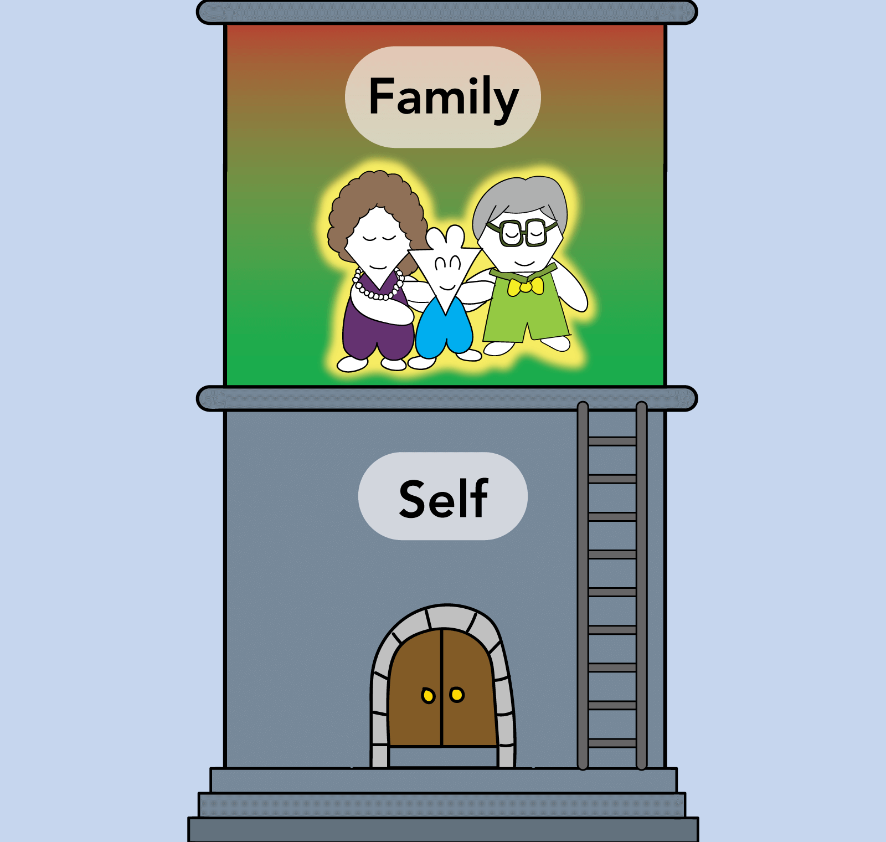](https://moretothat.com/wp-content/uploads/2020/01/I05-Hugging-family.png)

Many people will stop here in the tower of influence. They might be content in providing for themselves and their family, and won’t progress through additional power structures. But more likely, if those two layers are fulfilled, they will look to help or influence the health of the close-knit groups they’re a part of.  

许多人将在影响之塔中停在这里。他们可能满足于供养自己和家人，不会通过额外的权力结构取得进展。但更有可能的是，如果这两层得到满足，他们会寻求帮助或影响他们所处的亲密团体的健康。

Next up is the domain of community.  

接下来是社区领域。

So what does the Power Tradeoff look like here?  

那么，这里的权力权衡是什么样子的呢？

People in your close communities know you quite well, and you are generally together for some shared purpose. That glue might be religion, it may be service, or it could be something more value-free like entertainment. Regardless of what it is, this purpose is distributed across each of its members, and equalizes everyone’s role in this communal playing field.  

你身边的人都很了解你，而且你们一般都是为了一些共同的目的而在一起。这种粘合剂可能是宗教，可能是服务，也可能是一些更无价值的东西，如娱乐。无论它是什么，这个目的是分布在每个成员身上的，并使每个人在这个社区的竞争环境中的角色平等。

[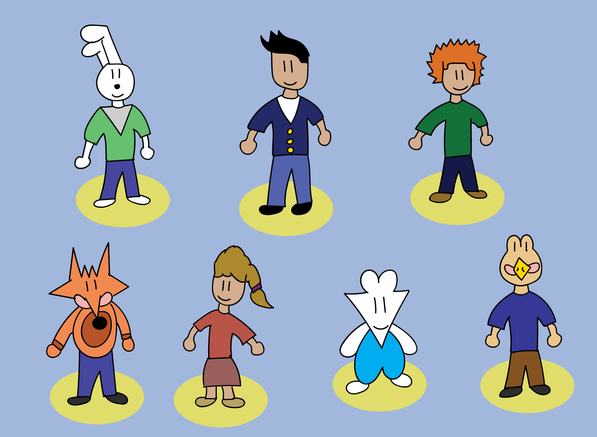](https://moretothat.com/wp-content/uploads/2020/01/J01-Community-across-members.png)

Influencing the community through money, however, can complicate the situation.  

然而，通过金钱影响社区，会使情况变得复杂。

If you decide to make an outsized donation and everyone hears about it, this is likely to happen:  

如果你决定做一笔大额捐款，而每个人都听说了，这很可能发生：

[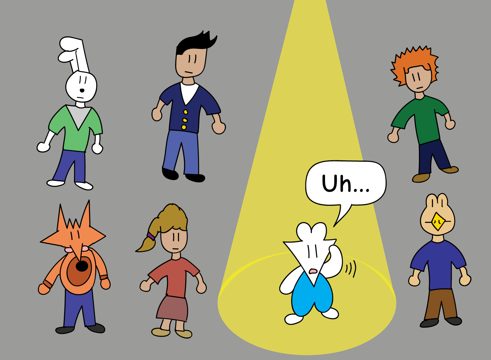](https://moretothat.com/wp-content/uploads/2020/01/J02-Spotlight-attention.png)

The tricky thing with money is that it’s often used as a measuring stick of one’s value to their community. If you give a lot of money to a cause you care about, that might be the way people gauge how much that cause means to you, as nuance tends to be removed the larger the group is.  

金钱的棘手之处在于，它经常被用作衡量一个人对其社区价值的标尺。如果你给你关心的事业提供了大量的钱，这可能是人们衡量该事业对你意味着什么的方式，因为群体越大，细微的差别往往就越大。

I mentioned earlier that financial freedom is obtained by the elimination of attention, but the reverse is also true. Financial freedom is diminished by the constant receipt of attention as well.  

我在前面提到，财务自由是通过消除关注获得的，但反过来也是如此。财务自由也会因不断接受关注而减少。

The more you are viewed through the lens of money, the less you are able to break free from the identity of money. For some, that may not necessarily be a bad thing. Perhaps you’re a financial advisor, and your personal wealth has to be a reliable signal to others that you know what you’re doing.  

你越是通过金钱的视角来看待你，你就越是无法从金钱的身份中挣脱出来。对某些人来说，这不一定是件坏事。也许你是一名财务顾问，你的个人财富必须成为一个可靠的信号，向他人表明你知道自己在做什么。

But if you just want to elevate the financial health of your local church, being “that person that gives a shitload of money” can be a cumbersome role to play. Money is a low-resolution surrogate for your value judgments, and sadly, many people have a hard time making this distinction.4  

但是，如果你只是想提高当地教会的财务健康水平，成为 "那个捐出大量金钱的人 "可能是一个麻烦的角色。钱是你价值判断的低分辨率代用品，可悲的是，许多人很难做出这种区分。

The closest members of your communities, however, may be more nuanced in their perceptions. They may not be as close to you as your immediate family, but they can understand your principles, your values, and the things that make you who you are, independent of wealth.  

然而，你的社区中最亲密的成员，在他们的看法中可能会有更细微的差别。他们可能不像你的直系亲属那样亲近你，但他们可以理解你的原则，你的价值观，以及使你成为你的人的东西，与财富无关。

In the community layer, the Power Tradeoff is still more positive than negative, but not as much as the family layer below. The impact of money can go far, but since there are more people involved (some of whom you may not even know), the many shades of your identity can start congealing into the singular dimension of wealth.  

在社区层，权力交易仍然是正面多于负面，但不像下面的家庭层那样多。金钱的影响可以走得很远，但由于有更多的人参与（其中一些人你可能甚至不认识），你身份的许多阴影可以开始凝结成财富这个单一的维度。

The balance is finer here. Use your money mindfully, and the community will thrive with you. Use it recklessly, and you will be vilified by the very community you were trying to help. Money can breed all kinds of weird group behaviors, so your judgment must be sharp when navigating this domain.  

这里的平衡更精细。谨慎地使用你的钱，社区将与你一起茁壮成长。鲁莽地使用它，你就会被你试图帮助的社区所诋毁。金钱可以滋生各种奇怪的群体行为，所以你的判断力必须在这一领域中保持清醒。

For the vast majority of us, this is where our desire for influence (as it relates to money) will stop. Having the power to help people we know yields a sense of fulfillment, and that is enough to keep us contented for the rest of our lives.  

对我们绝大多数人来说，这就是我们对影响力的渴望（因为它与金钱有关）将停止。有能力帮助我们认识的人，就会产生一种成就感，而这足以让我们在余生中感到满足。

However, there are some people that want to go beyond their immediate circles, and use their money to direct the behaviors of people they don’t know at all. They want their wealth to go far, and act as the tool to spread influence over the lives of many. This type of power can range from the smaller scale of things (local non-profit groups, influencing district elections, angel investing, etc.) all the way to the largest scale we could think of (global philanthropy, influencing presidential elections, big venture capital firms, etc.).  

然而，有一些人想超越他们的直接圈子，用他们的钱来引导他们完全不认识的人的行为。他们希望自己的财富能走得更远，并作为工具对许多人的生活施加影响。这种类型的权力可以从较小规模的事情（地方非营利组织，影响地区选举，天使投资等）一直到我们能想到的最大规模（全球慈善事业，影响总统选举，大型风险投资公司等）。

To simplify this massive range of possibilities, let’s all throw them into one final layer titled “People You Don’t Know.”  

为了简化这个巨大的可能性范围，让我们把它们全部扔到最后一层，名为 "你不认识的人"。

Of all the layers in the tower of influence, this one is by far the riskiest. This is where “power + money” gets its shitty reputation, and people tend to be skeptical of the folks that operate here.  

在影响力之塔的所有层级中，这一层是迄今为止风险最大的。这是 "权力+金钱 "获得低劣声誉的地方，人们倾向于对在这里运作的人持怀疑态度。

To illustrate why, recall this scenario from the community level:  

为了说明原因，请回顾一下社区层面的这个场景：

[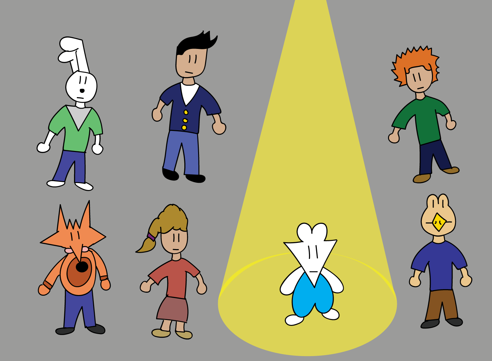](https://moretothat.com/wp-content/uploads/2020/01/J04-Community-attention-without-talking-bubble.png)

And realize that when you’re operating at the “People You Don’t Know” level, you get this daunting situation:  

并意识到，当你在 "你不认识的人 "层面上运作时，你会得到这种令人生畏的情况：

[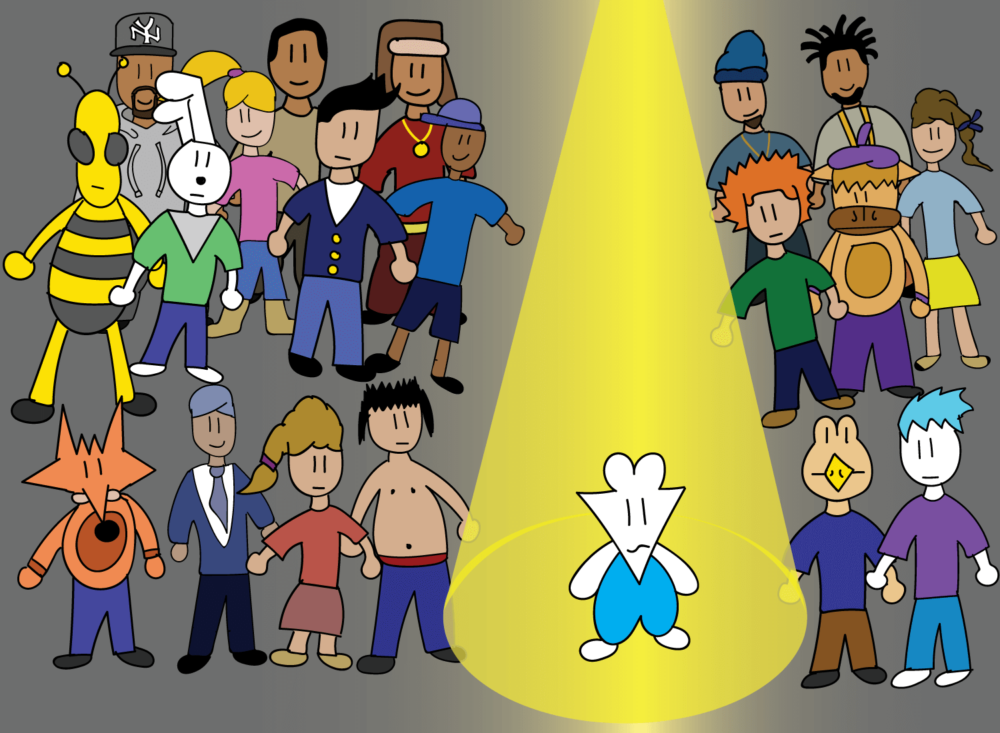](https://moretothat.com/wp-content/uploads/2020/01/J03-People-you-do-not-know-attention.png)

With that much attention to your financial decisions, it’s easy to be perceived as a caricature of your money. People that don’t know you are indifferent to the relationships you have with your neighbors, the fact that your sister may be ill, or the details of your daily meditation practice. You are defined primarily by your wealth, and what you do with your wealth shapes the perceptions of your character.  

对你的财务决定如此关注，很容易被认为是你的金钱的漫画。不了解你的人对你与邻居的关系、你妹妹可能生病的事实、或你日常冥想练习的细节都无动于衷。你主要是由你的财富来定义的，而你对你的财富所做的事情塑造了人们对你性格的看法。

You may think I’m overgeneralizing here, but when you mix wealth into someone’s list of attributes, everything else seems to go out the window. Want to see evidence of this? Put the name of any prominent businessperson or entrepreneur in Google, and guess what will always pop up as a top search suggestion:  

你可能认为我在这里以偏概全，但当你把财富混入某人的属性清单时，其他一切似乎都会被淘汰。想看看这一点的证据吗？把任何杰出的商人或企业家的名字放在谷歌上，猜猜看，什么东西总是作为最重要的搜索建议弹出来：

This is what people care about most.  

这就是人们最关心的事情。

This singular view of identity is the source of most problems on the “People You Don’t Know” layer. If everyone knew you as an artist, you couldn’t help but to see the world through the lens of creation. Similarly, if everyone used wealth to define you, then you will likely solve problems through the lens of money.  

这种对身份的单一看法是 "你不认识的人 "这一层中大多数问题的来源。如果每个人都知道你是个艺术家，你就会情不自禁地通过创作的视角来看待世界。同样地，如果每个人都用财富来定义你，那么你很可能会通过金钱的视角来解决问题。

Sometimes this works out well for humanity. For example, Bill Gates is using his power to help solve some of [the world’s greatest problems](https://www.vanityfair.com/hollywood/2019/09/bill-gates-interview-netflix-inside-bills-brain). But for every Bill Gates, there may be thousands of people that want their money to influence others in less fruitful ways. Political corruption and racketeering are just a few examples here. When money is used to solve big problems in zero-sum games, it usually comes at the expense of the powerless.  

有时这对人类来说是很好的结果。例如，比尔-盖茨正在利用他的力量帮助解决世界上的一些最大问题。但是，对于每一个比尔-盖茨来说，可能有成千上万的人希望他们的钱能以不太有效的方式影响他人。政治腐败和敲诈勒索只是这里的几个例子。当金钱被用来解决零和游戏中的大问题时，它通常是以牺牲无权无势者为代价的。

But of course, being rich and powerful doesn’t imply that you’re evil. The truth is far from that. I’m reminded of this great illustration, which depicts the reality of the situation:  

但当然，富有和强大并不意味着你是邪恶的。事实远非如此。我想起了这幅伟大的插图，它描绘了现实的情况：

There are plenty of wealthy, influential people that have the best intentions in mind. The point I’m making, however, is that operating in the “People You Don’t Know” layer of influence is a tricky place, primarily because it tends to cultivate the feeling of attachment.  

有很多富有的、有影响力的人，他们的目的都是最好的。然而，我想说的是，在 "你不认识的人 "的影响层中运作是一个棘手的地方，主要是因为它往往会培养出依恋的感觉。

I don’t have the personal wealth to operate in this final layer, but I imagine that much of the struggle here comes from the inability to detach one’s wealth from the rest of their persona. I’ve read cases about [executives](https://www.nytimes.com/2008/11/07/business/07suicide.html) (and even [a billionaire](https://www.reuters.com/article/us-merckle-newsmaker-sb/german-billionaire-commits-suicide-after-vw-losses-idUSTRE5055O820090106)) committing suicide because they lost money in the 2008 recession. That might sound crazy to someone like me, but then again, I don’t know what it feels like to have my personal wealth define my entire existence.  

我没有个人财富来操作这最后一层，但我想象，这里的大部分挣扎来自于无法将一个人的财富从他们的其他角色中分离出来。我读过关于高管（甚至一个亿万富翁）自杀的案例，因为他们在2008年的经济衰退中失去了资金。这对像我这样的人来说可能听起来很疯狂，但话说回来，我不知道让我的个人财富定义我的整个存在是什么感觉。

Money is a tool, but if that tool defines how you impact the lives of thousands of people, it will be of utmost importance for you to continue having it.  

钱是一种工具，但如果这个工具决定了你如何影响成千上万人的生活，那么继续拥有它对你来说将是最重要的。

And when it comes to attachment, these three words sum it up well:  

而说到依恋，这三个词很好地概括了它：

Ironically, the end of the Money Spectrum can breed just as much fear as the Survival entrance into it. Having immense power can make someone just as fearful of losing their money as a person who needs it to survive another day.  

具有讽刺意味的是，金钱谱系的末端和生存谱系的入口一样，都会滋生恐惧。拥有巨大权力的人和需要钱来生存的人一样害怕失去他们的钱。

This tendency toward attachment is what makes the Power Tradeoff in this final level an unfavorable bet:  

这种依恋的倾向是使这最后一关的权力交易成为不利的赌注的原因：

[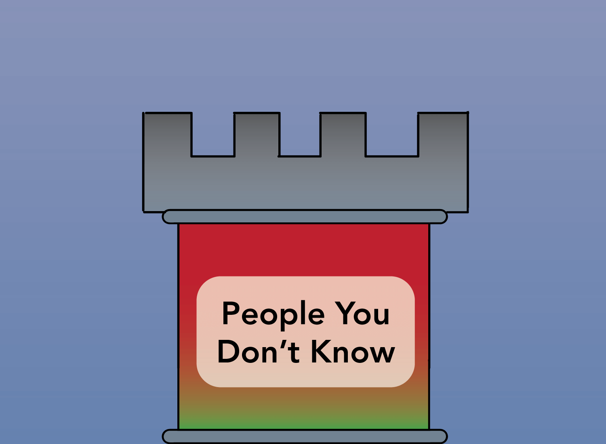](https://moretothat.com/wp-content/uploads/2020/01/I10-Close-up-of-people-you-do-not-know-layer.png)

Now that we’ve colored in each layer, let’s take a step back and look at the tower of influence in its entirety.  

现在我们已经在每一层上了色，让我们退后一步，看看影响塔的整体情况。

[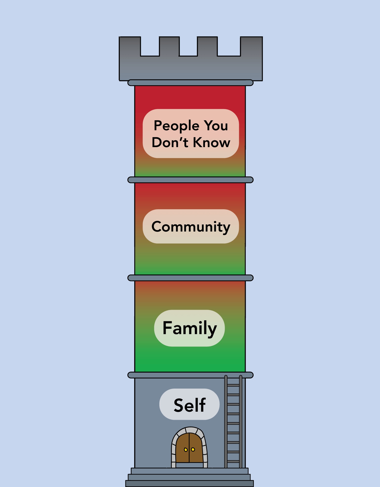](https://moretothat.com/wp-content/uploads/2020/01/I10-People-you-do-not-know-Power-Tradeoff.png)

At the moment, it looks like a collage of individual red-and-green spectrums, but if we blend them all together to create an average Power Tradeoff for the whole thing, it’ll look something like this:  

目前，它看起来像一个单独的红色和绿色光谱的拼贴画，但如果我们将它们混合在一起，为整个事物创建一个平均功率折衷，它将看起来像这样的东西：

This is a good summarization of what the Power phase looks like on the Money Spectrum. Money can work well for you in the domain of the self and the family, but it can create attachment when it gives you power over many people. When your identity becomes defined by the influence of money, you are wading into dangerous waters, and you will have to exercise brilliant judgment to navigate through it properly.  

这是对金钱谱系中权力阶段的一个很好的总结。在自我和家庭领域，金钱对你来说可以很好地发挥作用，但当它给你带来对许多人的权力时，它就会产生依恋。当你的身份被金钱的影响所定义时，你就会涉足危险的水域，你将不得不行使出色的判断力来正确地驾驭它。

At the same time, if your judgments are right, you will be able to do immense good. Just consider all the tradeoffs that exist toward the end of the Money Spectrum, and understand how your decisions ripple through each subsequent layer below it.  

同时，如果你的判断是正确的，你将能够做巨大的好事。只要考虑到金钱谱系末端存在的所有权衡，并理解你的决定如何在下面的每一层中产生涟漪。

### Where Are You On The Money Spectrum?  

你在金钱谱系上的位置？

We’ve conducted a comprehensive review of all three phases, so now it’s time to zoom out and see the Money Spectrum as a whole.  

我们已经对所有三个阶段进行了全面的审查，所以现在是时候放大并将货币谱系作为一个整体来看。

The first question I ask myself when I see this is, “What determines someone’s place on this spectrum?”  

当我看到这一点时，我问自己的第一个问题是："是什么决定了某人在这个光谱上的位置？"

The initial assumption here might be the amount of money you have. After all, if you have no money, you’re probably scraping for survival, but if you have a lot, you can exercise great freedom and power with it.  

这里的最初假设可能是你有多少钱。毕竟，如果你没有钱，你可能在为生存而奔波，但如果你有很多钱，你可以用它行使巨大的自由和权力。

[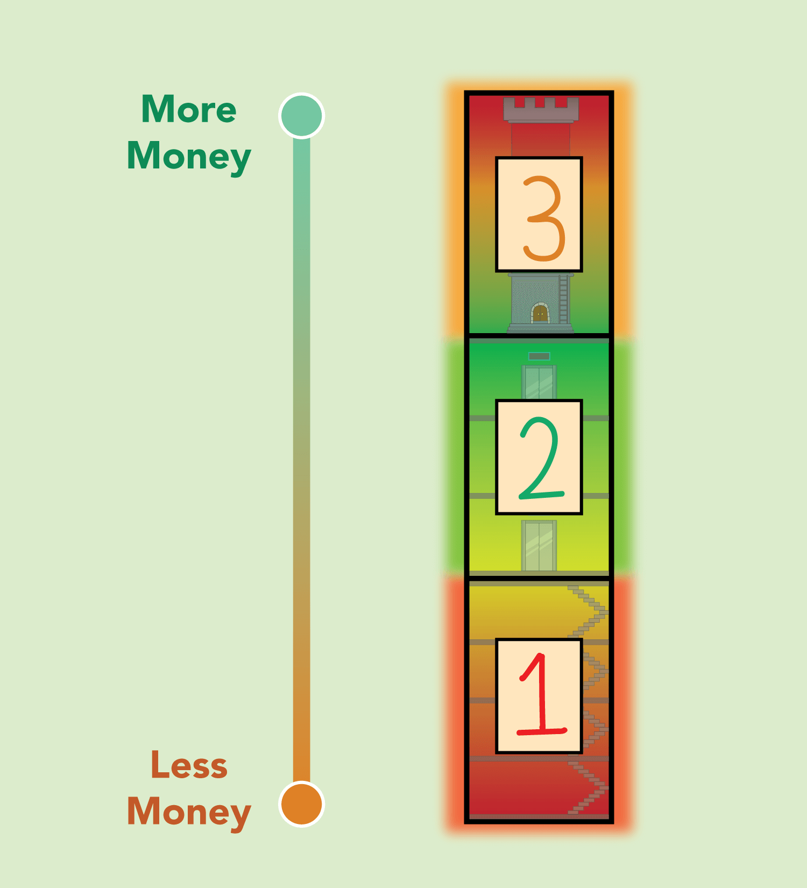](https://moretothat.com/wp-content/uploads/2020/01/K02-Axis-of-More-and-Less-Money-Smaller-2.png)

But this is simply not true.  

但这根本不是事实。

You can have a modest sum of money, but live high up on the Freedom phase. A good example would be someone that makes $30K a year, but earns it doing work she loves. On top of that, she lives a lifestyle where she reliably spends just $20K a year. She has freedom-in-work, and power-over-the-self. She is a rich person.  

你可以有一笔不多的钱，但在自由阶段生活得很高。一个很好的例子是一个年薪3万美元的人，但她从事的是她喜欢的工作。除此之外，她的生活方式是每年只花2万美元。她有工作上的自由，也有超越自我的力量。她是一个富有的人。

Conversely, you can have a large sum of money, but be low on the Survival phase. This would be someone that makes $300K a year, but earns it doing work he hates. On top of that, he lives a lifestyle where he is racked up in credit card debt, with a mortgage on a house he can’t even afford. He has limited freedom, and is barely scraping by. He is a poor person.  

相反，你可以有一大笔钱，但在生存阶段却很低。这将是一个年薪30万美元的人，但他是在做他讨厌的工作。此外，他的生活方式是信用卡债务累累，房子的抵押贷款他甚至负担不起。他的自由有限，只能勉强维持生计。他是一个可怜的人。

There are many variations of this that highlight the inadequacy of the “money-in-the-bank” metric. There are many millionaires that have no desire to influence or help their families and close communities. On the other hand, there are people earning a minimum wage that send what little they have back home to assist their parents and friends.  

这种情况有很多变化，突出了 "银行里的钱 "这一衡量标准的不足。有许多百万富翁不愿意影响或帮助他们的家庭和邻近社区。另一方面，也有一些赚取最低工资的人，把他们仅有的一点钱寄回家里，帮助他们的父母和朋友。

The amount of money you have is not the proper lens to view your place on the Money Spectrum.  

你有多少钱并不是看待你在金钱谱系上的位置的正确镜头。

[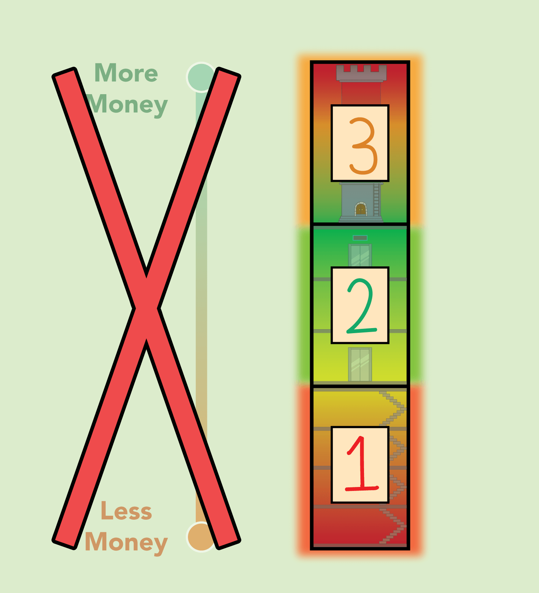](https://moretothat.com/wp-content/uploads/2020/01/K03-Crossing-out-money-axis.png)

So if money itself doesn’t determine your place on the Money Spectrum, then what the hell does?  

因此，如果金钱本身并不能决定你在金钱谱系上的位置，那么到底是什么决定了你的位置？

Well, the answer may sound trite, but it’s the truth.  

好吧，这个答案可能听起来很老套，但这是事实。

You choose your position yourself.  

你自己选择你的位置。

[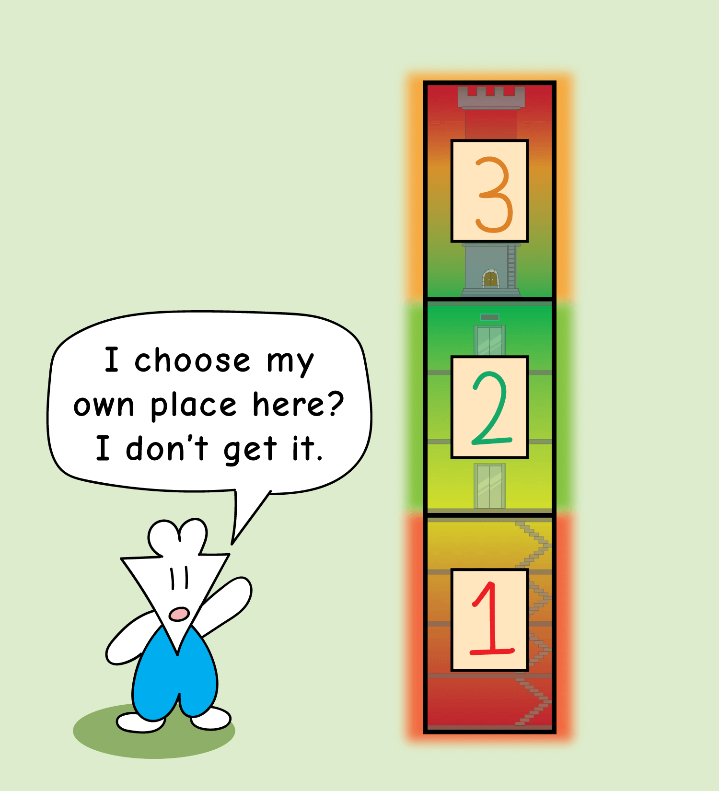](https://moretothat.com/wp-content/uploads/2020/01/K04-Asking-about-place-on-the-spectrum.png)

To understand what I mean, we need to first view things through the right frame. Instead of viewing the spectrum through the lens of how much money you have, you must view it through the emotional ranges of two things: clarity and fear.  

为了理解我的意思，我们首先需要通过正确的框架来看待事物。与其通过你有多少钱来看待光谱，你必须通过两件事的情感范围来看待它：清晰和恐惧。

The lower you are in Survival mode, the more fearful you are of money and its impact on your life. However, as you move up the Survival phase and get closer to Freedom, the fear surrounding money gradually fades and things enter the domain of clarity.  

你在生存模式中的地位越低，你就越害怕金钱和它对你生活的影响。然而，当你上升到生存阶段并接近自由时，围绕金钱的恐惧逐渐消失，事情进入清晰的领域。

When you’re in the Freedom phase, things are more clear, but freedom-in-leisure is still a somewhat hazy place. You start having more control over your life the higher you go, and the greatest benefits come when you’re in the freedom-in-work and the freedom-in-attention areas of this phase.  

当你处于自由阶段时，事情更加清晰，但休闲中的自由仍然是一个有点模糊的地方。你开始对你的生活有更多的控制，当你在这个阶段的工作自由和注意力自由领域时，最大的好处是。

This is what I call the sweet spot, and it is where your wealth goes the longest way, regardless of how much you have.  

这就是我所说的甜蜜点，它是你的财富走得最远的地方，不管你有多少财富。

[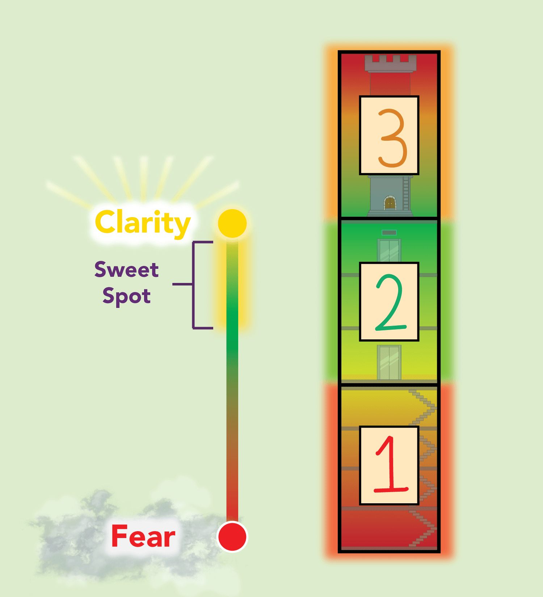](https://moretothat.com/wp-content/uploads/2020/01/K06-Sweet-Spot.png)

If you make the decision to proceed further into the Power phase, then you must enter the tower of influence, where Power Tradeoffs become increasingly tenuous the higher you go. Exercising your influence through money may be more manageable with your family, but once it goes into the layers of communities and people you don’t know, there’s more at stake. Attachment can become fervent, and fear can dominate the spectrum once again.  

如果你决定进一步进入权力阶段，那么你必须进入影响力之塔，在那里，权力的权衡变得越来越脆弱，你走得越高。通过金钱行使你的影响力，对你的家人来说可能更容易管理，但一旦进入社区和你不认识的人的层面，就会有更多的风险。依恋会变得狂热，而恐惧会再次主宰整个光谱。

The Money Spectrum makes the most sense when you view it alongside this gradation of emotions. It helps you understand that money is not something you own, it’s something you have a relationship with. And just like the people you choose to have around you, it’s a bond that is shaped with intention and care.  

当你把金钱谱系与这种情绪分级一起看时，它是最有意义的。它帮助你理解金钱不是你拥有的东西，它是你与之有关系的东西。就像你选择在你身边的人一样，它是一种用意图和关怀塑造的纽带。

Of all the things that define your place on this spectrum, the most important one is your identity. Which phase do you see yourself in the most?  

在界定你在这个光谱上的位置的所有事情中，最重要的是你的身份。你认为自己在哪个阶段最合适？

If you view the world through the lens of scarcity and survival, money will only amplify that feeling of inadequacy. But if freedom is what defines you, then money will feel abundant, no matter how much you have. If power and influence is what you want, then money will drive the nature of your relationships in that direction.  

如果你通过匮乏和生存的视角来看待世界，金钱只会放大这种不足的感觉。但是，如果自由是你的定义，那么无论你拥有多少钱，都会感到充实。如果权力和影响是你想要的，那么金钱将推动你的关系朝着这个方向发展。

Where on this spectrum do you think you are now? And where do you want to be? What’s holding you back? Is it money, or is it your mentality?  

你认为你现在在这个光谱上的什么位置？你又想在哪里？是什么在阻碍你？是钱，还是你的心态？

Be honest with yourself when asking these questions. Your identity will inevitably answer them for you, but you don’t want any surprises when it does.  

问这些问题时要对自己诚实。你的身份不可避免地会为你回答这些问题，但你不希望在它回答时出现任何意外。

After all, if you don’t give money its purpose, it will end up defining yours.  

毕竟，如果你不给钱它的目的，它最终将定义你的目的。

\_\_\_\_\_\_\_\_\_\_\_\_\_\_\_

If you enjoyed this post, consider joining the More To That newsletter. You’ll be notified when a new post is up, and will get access to personal reflections that you won’t find anywhere else.

  

如果你喜欢这篇文章，考虑加入More To That通讯。当有新文章时，你会得到通知，并能获得你在其他地方找不到的个人反思。

As a welcome gift, I will send you a 10-page ebook called _How to Discover Great Ideas_, and a pack of colorful wallpapers for your phone.  

作为欢迎礼物，我将寄给你一本10页的电子书，名为《如何发现伟大的想法》，以及一包用于手机的彩色壁纸。

  

If you’d like to support the many hours that go into making these posts, you can do so at my [Patreon page here](https://www.patreon.com/moretothat).  

如果你想支持这些帖子所花费的许多时间，你可以在我的Patreon页面上这样做。

Thanks to Nick Maggiulli (writer of the great blog [Of Dollars and Data](https://ofdollarsanddata.com/)) for reading a draft of this post.  

感谢Nick Maggiulli（伟大的博客Of Dollars and Data的作者）阅读这篇文章的草稿。

\_\_\_\_\_\_\_\_\_\_\_\_\_\_\_

### Related Posts  

相关帖子

**How did money take over humanity? The full story is here:  

钱是如何占领人类的？完整的故事在这里：**

[How Money Forever Changed Us  

金钱如何永远改变了我们](https://moretothat.com/how-money-forever-changed-us/)

**Money can take you all over the world, but travel won’t bring you happiness:  

钱可以带你走遍世界，但旅行不会给你带来幸福：**

[Travel Is No Cure for the Mind  

旅行是无法治愈心灵的疾病](https://moretothat.com/travel-is-no-cure-for-the-mind/)

**A reminder that money (or any other thing) won’t give you meaning either:  

提醒我们，金钱（或任何其他东西）也不会给你带来意义：**

[The Meaning of Life Is Absurd  

生命的意义是荒谬的](https://moretothat.com/the-meaning-of-life-is-absurd/)

**But here’s a reflection that will help put everything back into perspective:  

但这里有一个反思，将有助于把一切都放回正轨：**

[The Finality of Everything  

一切的终结性](https://moretothat.com/the-finality-of-everything/)
